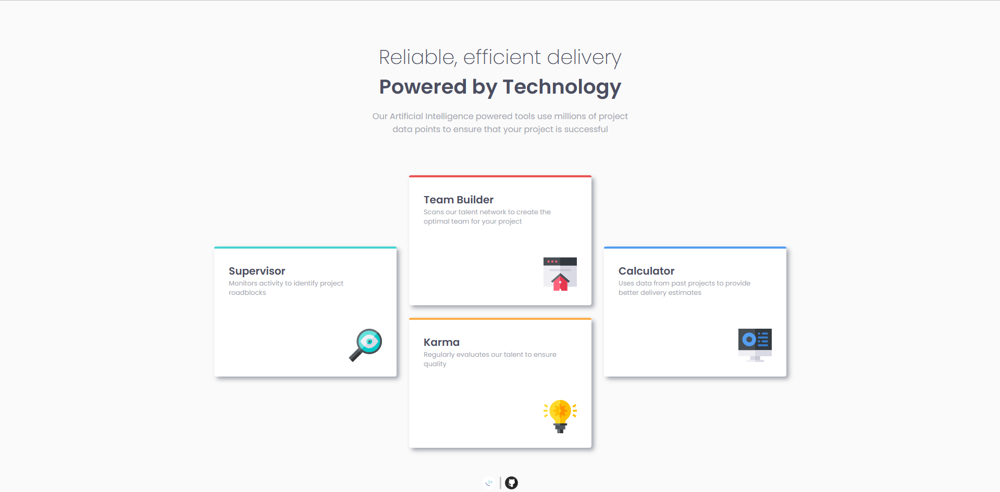
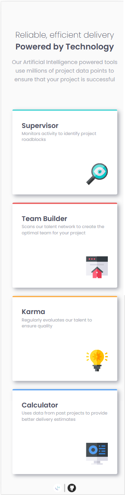

# Frontend Mentor - Four card feature section solution

This is a solution to the [Four card feature section challenge on Frontend Mentor](https://www.frontendmentor.io/challenges/four-card-feature-section-weK1eFYK). Frontend Mentor challenges help you improve your coding skills by building realistic projects. 

## Table of contents

- [Overview](#overview)
  - [The challenge](#the-challenge)
  - [Screenshot](#screenshot)
  - [Links](#links)
- [My process](#my-process)
  - [Built with](#built-with)
  - [Continued development](#continued-development)
- [Author](#author)

## Overview

### The challenge

Users should be able to:

- View the optimal layout for the site depending on their device's screen size

### Screenshot

### Links

- Solution URL: [https://github.com/MoggStephen/four-card-feature-section-master]
- Live Site URL: [https://moggstephen.github.io/four-card-feature-section-master/]

## My process

- Setup file and folders
- Setup sass
- Add colors and font/font-sizes to css.
- Add all elements in html and link up css
- Use flexbox for layout.
- Code desktop first due to more difficult layout.
- Code the media query to change for mobile.
- Style all elements according to designs

### Built with

- Semantic HTML5 markup
- Sass, nesting an variables
- Flexbox
- Desktop-first workflow

### Continued development

- Continue with the naming. Sass naming could be changed to be better!

## Author

- Frontend Mentor - [@MoggStephen](https://www.frontendmentor.io/profile/MoggStephen)